# FinTech Labs IAM Modernization

This is my take-home project for the Week 1 IAM module. FinTech Labs is a made-up fintech startup that is moving from an old firewall-based network to a Zero Trust model after a developer's leaked password let an unauthorized script reach customer records.

The project has four parts: classifying identities, designing an access matrix, investigating a log, and writing a short summary for the CEO. I also built the access model in AWS to test it.

## Part 1: Identity inventory

| Entity | Type | Main risk if compromised |
|---|---|---|
| Sarah (backend engineer) | Workforce identity | Someone could get into the source code and deployment pipeline and change code. |
| Payment-Gateway-API-Key | Non-human / workload identity | Fraudulent charges or refunds. API keys often last a long time and are rarely rotated. |
| Alex (customer service rep) | Workforce identity | Customer personal data in support tickets could be exposed, or Alex could be targeted by social engineering. |
| Lambda-Log-Processor | Non-human / workload identity | An attacker could read or edit the audit logs and hide what they did. |

None of these are customer identities. Those would be the people who use the FinTech Labs product.

## Part 2: Access matrix

The brief didn't list the roles, so I picked these five.

| Role | Res-Dev-Code | Res-Prod-Database | Res-IAM-Console |
|---|---|---|---|
| Software Engineer | Read/Write | None | None |
| Database Administrator | None | Read/Write | None |
| IAM Security Admin | None | None | Read/Write |
| Security Auditor | Read | Read (logs/metadata only) | Read |
| Customer Support Rep | None | None | None |

How this meets Separation of Duties:
- Developers have no access to the production database, so they can't change customer records.
- DBAs have no access to the code repository, so they can't push code.
- Only the IAM Security Admin can change permissions, and that role can't touch code or data.
- Support staff work through the application and have no direct infrastructure access.

## Part 3: Incident investigation

Log entry from the 2 AM incident:

```json
{
  "timestamp": "2026-09-24T02:14:05Z",
  "identity_type": "IAM Role",
  "principal": "arn:aws:iam::123456789:role/DevOps-Deployment-Role",
  "source_ip": "198.51.100.42",
  "action": "rds:DownloadDBClusterSnapshot",
  "status": "SUCCESS"
}
```

**Authentication (who):** the action was done by an IAM role, `DevOps-Deployment-Role`. A role is not a person, so someone or something assumed it. I can't tell who from this log alone and would need to check the earlier `AssumeRole` events.

**Authorization (was it allowed):** yes, the status is `SUCCESS`. A deployment role shouldn't be able to download a production database snapshot, so this role has more permissions than it needs.

**Accounting (what, when, where):** a snapshot of the production database was downloaded at 02:14 UTC, in the middle of the night, from IP `198.51.100.42`. I would check whether that IP belongs to the company's VPN or build servers. If it doesn't, the access came from outside.

What I would do next:
1. Revoke the role's active sessions and rotate its credentials.
2. Remove snapshot and production database permissions from the role.
3. Find out how the role was assumed and review everything done from that IP.
4. Set up alerts for snapshot activity outside working hours.

## Part 4: Summary for the CEO

Our firewall was built for a time when everything important sat inside our office network. If you were inside, you were trusted. That isn't how we work anymore. Our systems run in the cloud, our team works from different places, and our applications talk to each other using keys and tokens that never go near the firewall.

That's what happened in our recent incident. A developer's password leaked, and a script used it to reach customer records. To the firewall it looked like normal, trusted traffic, so nothing was flagged.

Making identity the perimeter fixes this. Every person, application and script has to prove who it is each time it asks for access, and it only gets the permissions its job needs. Multi-factor authentication makes a stolen password much less useful. If one account is compromised, the damage stays small because that account can't reach much. And because every action is logged, we can spot unusual activity and trace it quickly.

In short, we stop asking where a request comes from and start asking who is making it and whether they should have access.

## AWS lab

To test the access model, I used two S3 buckets to stand in for the code repository and the production database. Then I wrote two custom policies so each team can only reach its own bucket.

### 1. Creating the buckets

I opened S3 and created two buckets in the Stockholm region: `fin-tech-dev-code-titi` for the dev code and `fintech-prod-data-titi` for the production data. I left the default settings, including Block Public Access, because neither bucket should ever be public.

<a href="01-s3-buckets.png">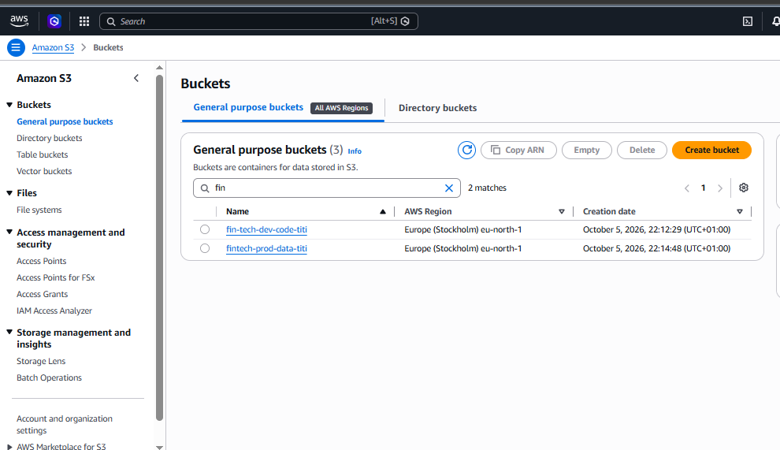</a>

### 2. Writing the policies

In IAM, I created two custom policies using the JSON editor, one for each team. Each one lists the exact actions allowed and the exact bucket they apply to. I didn't use a wildcard for the actions, and anything not listed is denied by default.

The first one, `FinTech-SoftwareEngineer-Policy`, only allows the dev bucket. The first statement lets the user see the list of buckets in the console, and the second gives list, read and write access to the dev bucket:

```json
{
  "Version": "2012-10-17",
  "Statement": [
    {
      "Sid": "AllowConsoleListing",
      "Effect": "Allow",
      "Action": ["s3:ListAllMyBuckets", "s3:GetBucketLocation"],
      "Resource": "*"
    },
    {
      "Sid": "AllowDevCodeAccessOnly",
      "Effect": "Allow",
      "Action": ["s3:ListBucket", "s3:GetObject", "s3:PutObject"],
      "Resource": [
        "arn:aws:s3:::fin-tech-dev-code-titi",
        "arn:aws:s3:::fin-tech-dev-code-titi/*"
      ]
    }
  ]
}
```

The second one, `FinTech-DBA-Policy`, is the same except that it points to the prod bucket:

```json
{
  "Version": "2012-10-17",
  "Statement": [
    {
      "Sid": "AllowConsoleListing",
      "Effect": "Allow",
      "Action": ["s3:ListAllMyBuckets", "s3:GetBucketLocation"],
      "Resource": "*"
    },
    {
      "Sid": "AllowProdDataAccessOnly",
      "Effect": "Allow",
      "Action": ["s3:ListBucket", "s3:GetObject", "s3:PutObject"],
      "Resource": [
        "arn:aws:s3:::fintech-prod-data-titi",
        "arn:aws:s3:::fintech-prod-data-titi/*"
      ]
    }
  ]
}
```

Because everything else is denied by default, these two policies are what keep the teams apart. Here is how both look in the console:

| Software Engineer policy | DBA policy |
|:---:|:---:|
| <a href="02-policy-software-engineer.png">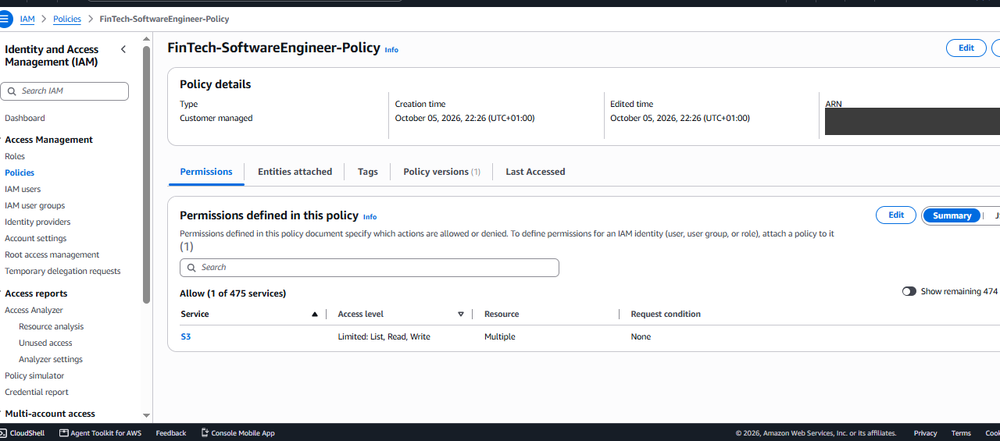</a> | <a href="03-policy-dba.png">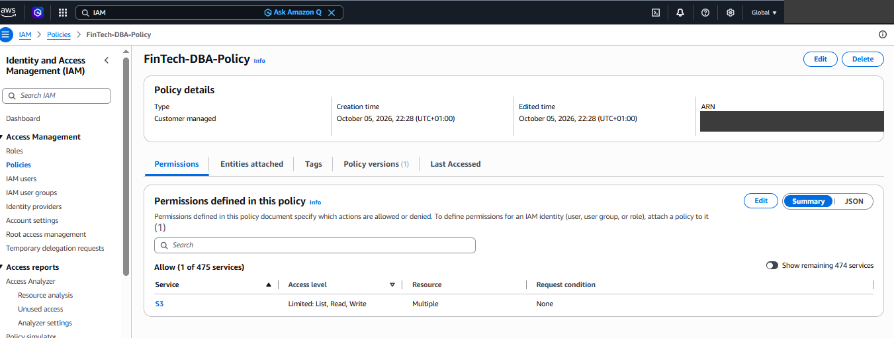</a> |

### 3. Groups and users

I attached each policy to a group instead of to a user. That way, when another engineer joins, I only have to add them to the group and don't need to touch the policy. I created `SoftwareEngineers` and `DatabaseAdmins`, then created two users, `sarah-dev` and `bob-dba`, and put each one in the matching group.

| SoftwareEngineers | DatabaseAdmins |
|:---:|:---:|
| <a href="04-group-software-engineers.png">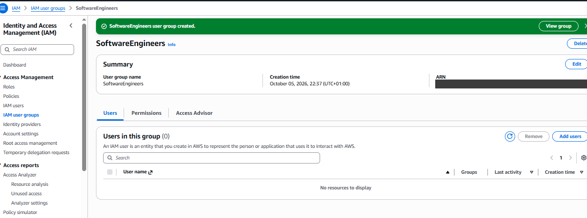</a> | <a href="05-group-database-admins.png">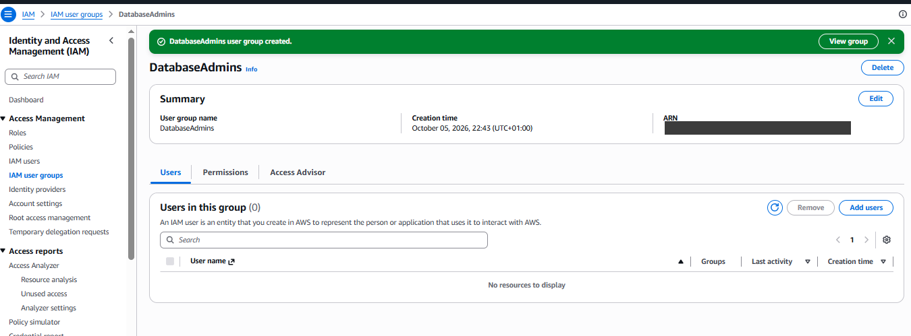</a> |

| sarah-dev | bob-dba |
|:---:|:---:|
| <a href="06-user-sarah-dev.png">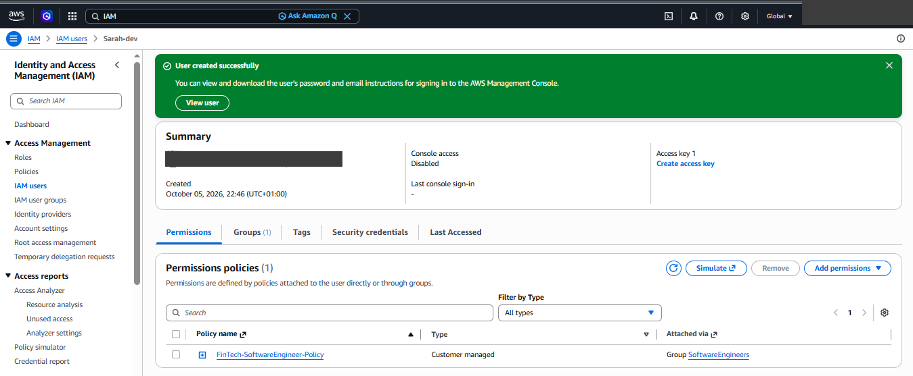</a> | <a href="07-user-bob-dba.png">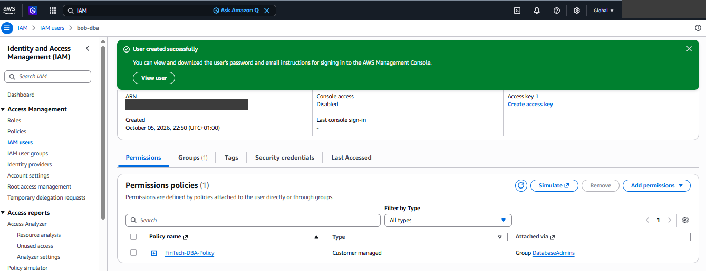</a> |

### 4. Testing

I signed in as each user and tried both buckets. In the bucket they were allowed to use, I uploaded a test file. In the other bucket, I just tried to open it.

Sarah could upload to the dev bucket but was denied on the prod bucket. Bob could upload to the prod bucket but was denied on the dev bucket.

**Sarah**

| Dev bucket (upload worked) | Prod bucket (denied) |
|:---:|:---:|
| <a href="08-sarah-dev-bucket-success.png">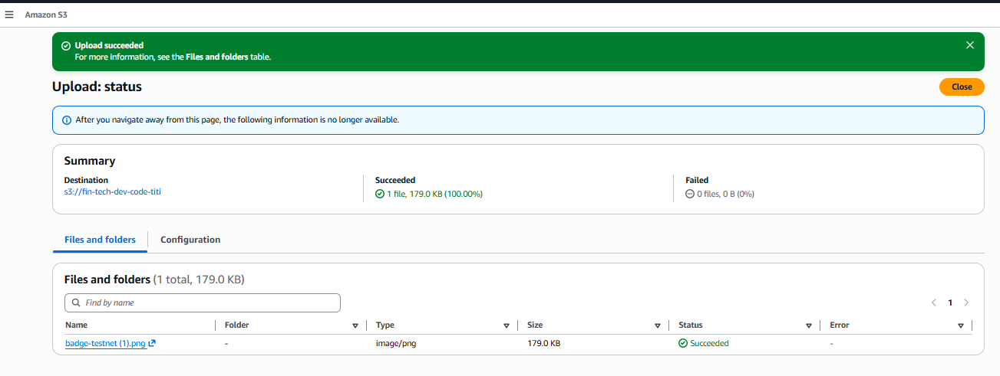</a> | <a href="09-sarah-prod-access-denied.png">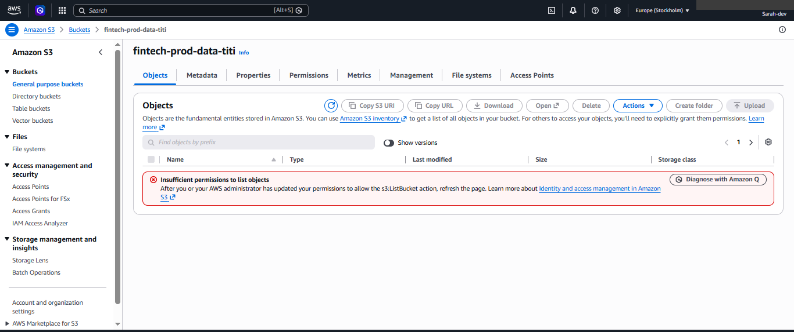</a> |

**Bob**

| Prod bucket (upload worked) | Dev bucket (denied) |
|:---:|:---:|
| <a href="10-bob-prod-bucket-success.png">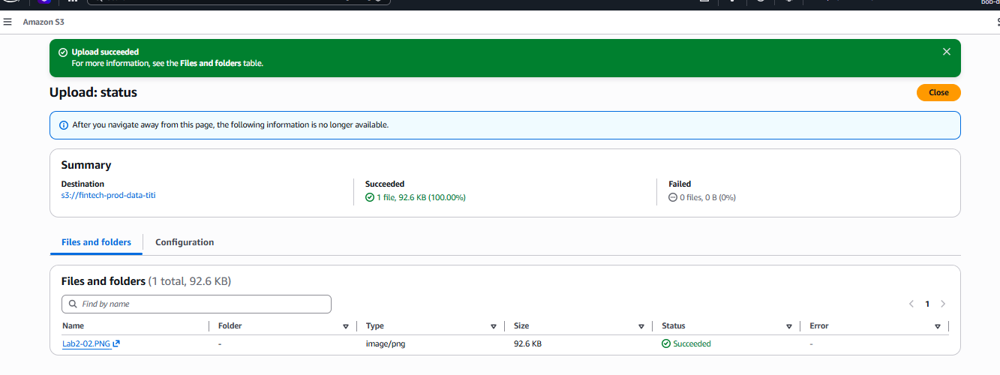</a> | <a href="11-bob-dev-access-denied.png">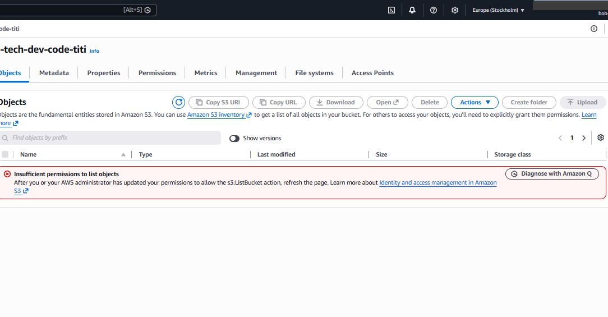</a> |

So each user can work in their own bucket and is blocked from the other one, which is the separation of duties I was aiming for.

### What went wrong the first time

My first test as Sarah on the dev bucket failed with "Insufficient permissions to list objects". The policy had the wrong bucket name in the resource ARN, so it never matched my bucket. After I fixed the ARNs to match the real bucket names, it worked. I also updated the DBA policy.

| First failed attempt | DBA policy after the update |
|:---:|:---:|
| <a href="12-troubleshoot-initial-denied.png">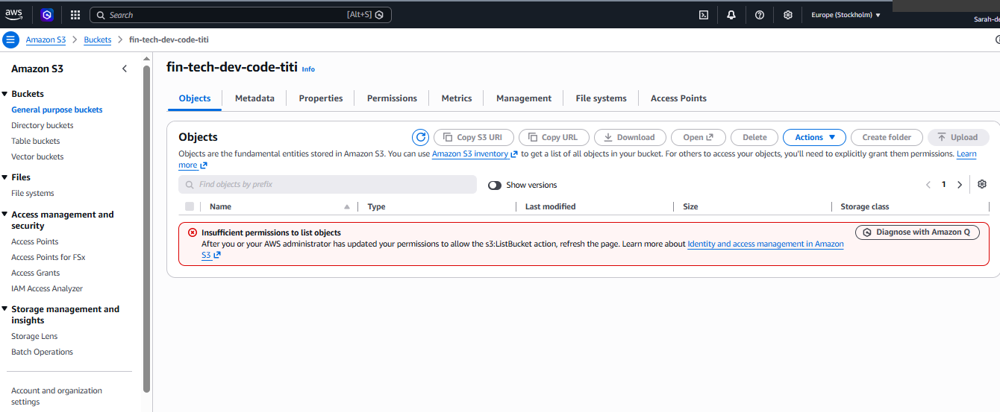</a> | <a href="13-troubleshoot-dba-policy-updated.png">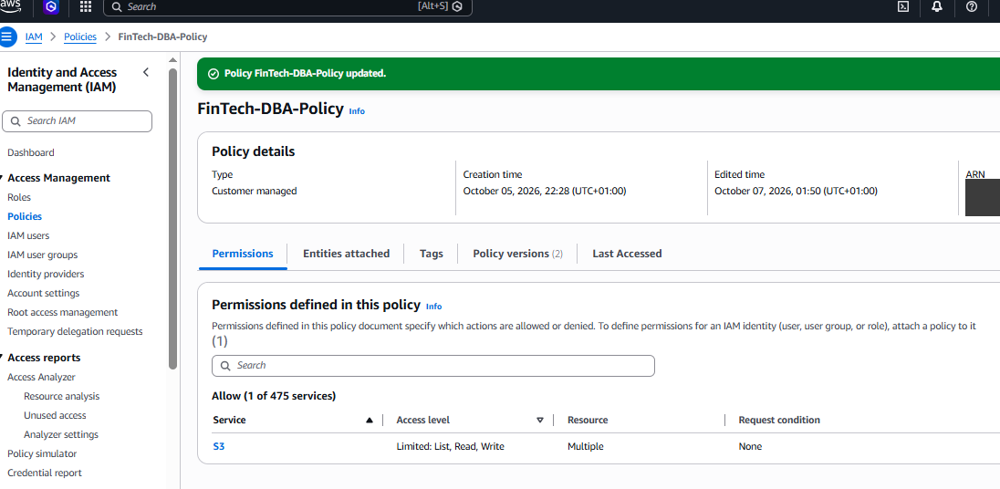</a> |

## What I learned

- **Give each person only what their job needs.** Sarah can only reach the dev bucket and Bob can only reach the prod bucket. If one of their accounts is stolen, the attacker can only get into that one bucket, not everything.

- **Keep duties separate.** No one person can both change the code and change the production data. This stops one mistake, or one stolen account, from causing damage in both places.

- **Small typos can break access.** My first test failed because the bucket name in my policy did not match the real bucket name. AWS only matches names exactly, so I now copy names straight from the console.

- **Anything not allowed is blocked.** I didn't write any "deny" rules. AWS blocks everything by default, so I only had to list what each person is allowed to do.

- **Testing matters.** I only knew the policies worked after signing in as each user and trying both buckets. Reading the policy was not enough.
